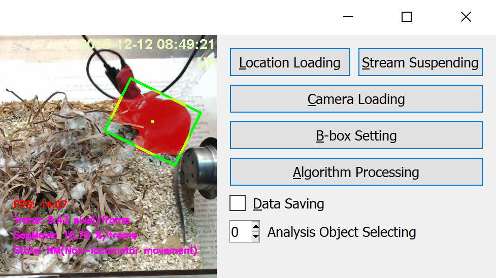

# SiamBOMB
This repo is just a preview version of SiamBOMB. \
For release version, please wait our paper to be accepted.

## Introduction
<p align="center"></p>

1. This project is based on [PySOT](https://github.com/STVIR/pysot).
2. We develop it with [PyQt5](https://www.riverbankcomputing.com/software/pyqt/intro).
3. It can import images, video and webcam.
4. It can setting multiple tracking objects.
5. It can do fundamental behavioral analysis and save data.
## Setup
### 1. Configure environments
* Linux (Ubuntu 18.04) or Windows (10)
* GPU (at least have 4 GB memory)
* CUDA 10.1 (with cudnn)
* Anaconda 4.8+
### 2. Install dependencies
```Shell
# create anaconda env
conda create -n SiamBOMB python=3.6
conda activate SiamBOMB

# install the pytorch
conda install pytorch torchvision cudatoolkit=10.1 -c pytorch

# install the pyqt5
pip install pyqt5-tools

# install other packages
pip install numpy opencv-python pyyaml yacs tqdm colorama matplotlib cython tensorboardX

# build extensions
python setup.py build_ext --inplace
```
### 3. Equip models
A simple SiamMask pretrained model: \
[Google Drive](https://drive.google.com/open?id=1YbPUQVTYw_slAvk_DchvRY-7B6rnSXP9), [Baidu Pan](https://pan.baidu.com/s/1q64A2jPEWmdj264XrfvhBA) (key: jffj) \
You can choose any model from: [Model Zoo](https://github.com/STVIR/pysot/blob/master/MODEL_ZOO.md) (need to modify codes).
## Demo
```Shell
python window_running.py
```
1. [Top three buttons] Choose one of three loading ways: images, video or webcam.
2. [B-box setting] Select several bounding for your targets, it can re-select.
3. [Algorithm processing] Do tracking and segmentation, press [Suspending] if you want to terminate.

## References
### Repositories
[PySOT](https://github.com/STVIR/pysot), 
[SiamFC](https://github.com/huanglianghua/siamfc-pytorch), 
[SiamRPN](https://github.com/foolwood/DaSiamRPN), 
[SiamMask](https://github.com/foolwood/SiamMask), 
[THOR](https://github.com/xl-sr/THOR), 
[SiamMask_E](https://github.com/baoxinchen/siammask_e), 
[SiamDW](https://github.com/researchmm/SiamDW)
### Papers
```
@inproceedings{SiamMask,
  title={Fast online object tracking and segmentation: A unifying approach},
  author={Wang, Qiang and Zhang, Li and Bertinetto, Luca and Hu, Weiming and Torr, Philip HS},
  booktitle={Proceedings of the IEEE conference on computer vision and pattern recognition},
  pages={1328--1338},
  year={2019}
}

@article{SiamMask_E,
  title={Fast visual object tracking with rotated bounding boxes},
  author={Chen, Bao Xin and Tsotsos, John K},
  journal={arXiv preprint arXiv:1907.03892},
  year={2019}
}

@article{THOR,
  title={Tracking Holistic Object Representations},
  author={Sauer, Axel and Aljalbout, Elie and Haddadin, Sami},
  journal={arXiv preprint arXiv:1907.12920},
  year={2019}
}

@article{A_Common_Hub,
  title={A common hub for sleep and motor control in the substantia nigra},
  author={Liu, Danqian and Li, Weifu and Ma, Chenyan and Zheng, Weitong and Yao, Yuanyuan and Tso, Chak Foon and Zhong, Peng and Chen, Xi and Song, Jun Ho and Choi, Woochul and others},
  journal={Science},
  volume={367},
  number={6476},
  pages={440--445},
  year={2020},
  publisher={American Association for the Advancement of Science}
}
```